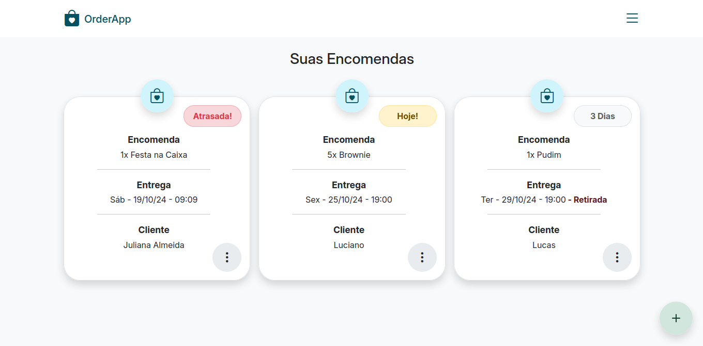
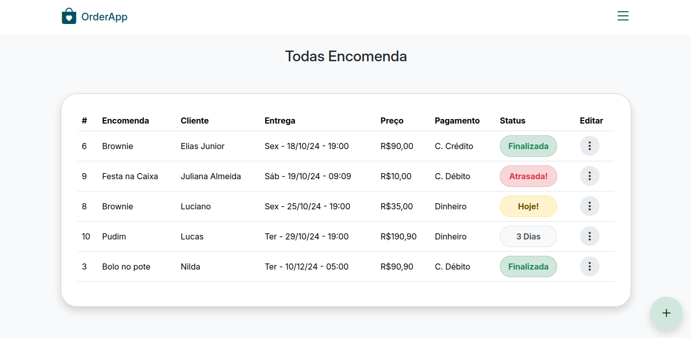

<h1 align="center">
     
    
     
    OrderApp
     
</h1>

<h4 align="center">
    Um aplicativo para descomplicar o gerenciamento de encomendas para confeiteras autônomas.
</h4>

  
   
  

<h3>Descrição</h3>

<b>OrderApp</b> é uma aplicação web projetada para permitir que confeteiras autônomas gerenciam suas encomendas de maneira simples e eficiente.

No geral, a aplicação permite que os usuários <b>Cadastrem</b> e <b>Acompanhem</b> seus pedidos.

Funcionalidades principais:
  - <b>Cadastro e Autenticação</b> de usuários;
  - <b>Cadastro de encomendas</b> com detalhes do pedido;
  - <b>Gerenciamento de encomendas</b> com histórico e status.

<h3>Tecnologias</h3>

A aplicação foi desenvolvida utilizando o padrão de projetos MVC (Model, View, Controller), com rotas dinâmicas, e suporta múltiplos usuários, onde cada um pode gerenciar seus dados de forma independente.

Tecnologias e ferramentas utilizadas:
- <b>PHP</b> para a lógica da aplicação;
- <b>Composer</b> para autoload das classes;
- <b>PostgreSQL</b> como banco de dados relacional;
- <b>Bootstrap</b> para componentes e design responsivo;
- <b>JavaScript</b> para funcionalidades dinâmicas;
- <b>Apache</b> como servidor web.

<h3>Instalação e Configuração</h3>

Para rodar a aplicação localmente, siga os passos abaixo:

- Iniciar o servidor <b>Apache</b> e o <b>PostgreSQL</b>.
- Clone o repositório dentro da pasta do <b>Apache</b>.
- Configure o arquivo `config.php` com suas credenciais de banco de dados e edite o `BASE_URL` conforme a necessidade.
- Ative o módulo ModRewrite no Apache: no terminal digite o comando `a2enmod rewrite` ou habilite nas configurações do <b>Apache</b>.
- Execute as instruções SQL do arquivo `database.sql`.

